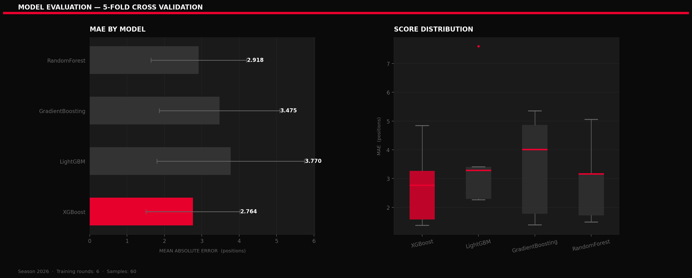
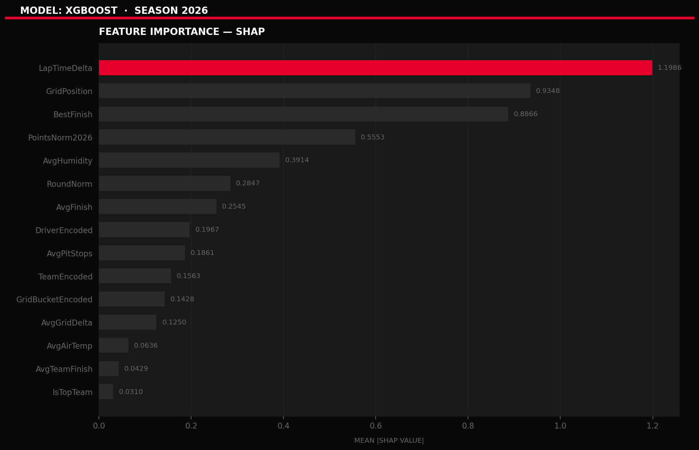
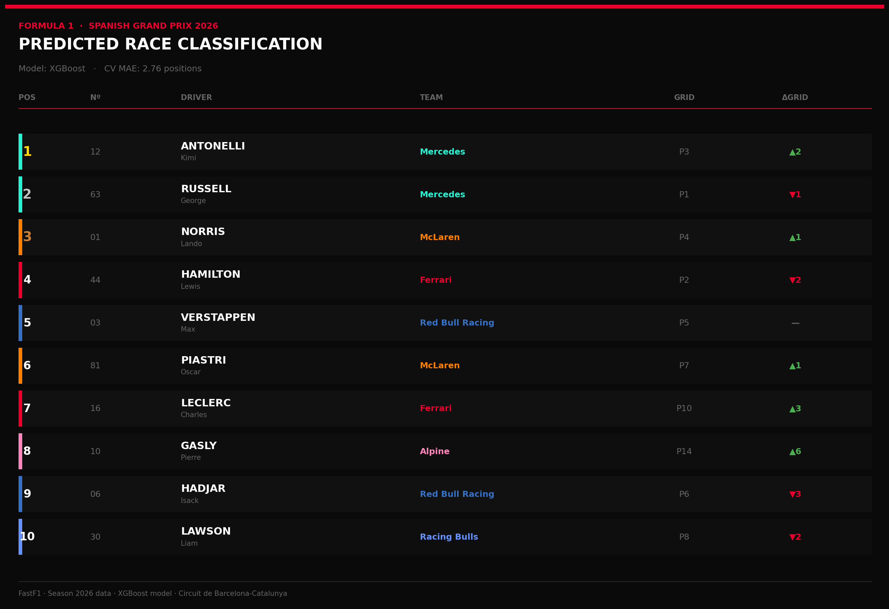
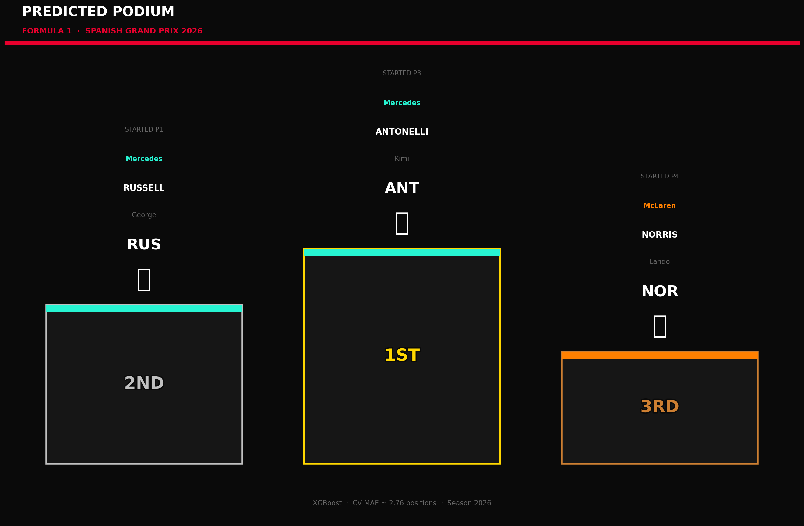
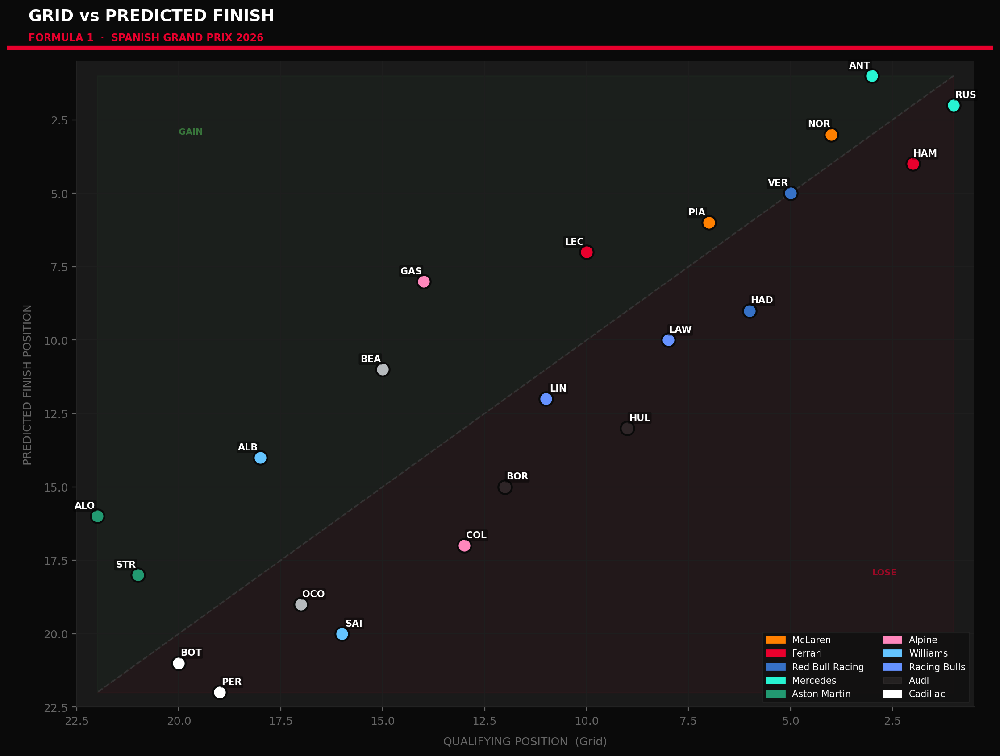

# 🏎️ 2026 F1 Barcelona Grand Prix — Race Prediction Model 

<p align="center">
  
  
  
  
  
</p>

<p align="center">
  Machine learning pipeline to predict the race classification of the 2026 Formula 1 Spanish Grand Prix at Circuit de Barcelona-Catalunya, trained exclusively on 2026 season data.
</p>

---

## 📋 Table of Contents

- [Objective](#-objective)
- [Data Collection](#-data-collection)
- [Project Pipeline](#-project-pipeline)
- [Feature Engineering](#-feature-engineering)
- [Models & Metrics](#-models--metrics)
- [Prediction Results](#-prediction-results)
- [Visualisations](#-visualisations)
- [Tech Stack](#-tech-stack)
- [Conclusions & Limitations](#-conclusions--limitations)
- [How to Run](#-how-to-run)

---

## 🎯 Objective

The goal of this project is to build a **complete machine learning pipeline** capable of predicting the finishing order of the 2026 Formula 1 Spanish Grand Prix, using only data collected from the **current 2026 season**.

Unlike approaches that use historical seasons as training data, this project deliberately restricts itself to 2026 data only. This is intentional: the 2026 season introduces **new technical regulations**, meaning car performance hierarchies, tyre behaviour, and team competitiveness have fundamentally changed. Training on previous seasons would introduce noise and mislead the model.

The pipeline covers the full data science workflow: extraction, engineering, normalisation, multi-model training with cross-validation, SHAP-based interpretability, and a final predicted race classification with professional F1-themed visualisations.

---

## 📡 Data Collection

All data is extracted via the **[FastF1](https://docs.fastf1.dev/)** Python library, which provides access to official Formula 1 timing data, telemetry, and session results through the F1 API and Ergast backend.

### What was collected

For each completed 2026 race (excluding Spain):

| Data Type | Fields Extracted |
|---|---|
| **Race Results** | FinishPosition, GridPosition, Points, Status (DNF/Finished) |
| **Driver Info** | Abbreviation, FullName, DriverNumber, Team |
| **Lap Statistics** | AvgLapTime, FastestLap, TotalLaps, NumPitStops |
| **Weather Data** | AvgAirTemp, AvgTrackTemp, AvgHumidity, AvgWindSpeed, Rainfall |

For the prediction session:

| Source | Data Used |
|---|---|
| **2026 Spanish GP Qualifying** | Grid positions, qualifying lap times |
| **2026 Season Aggregates** | Driver and constructor standings, performance averages |

### Data extraction logic

```python
# Automatically detects all completed 2026 races
schedule = fastf1.get_event_schedule(2026, include_testing=False)
completed = schedule[
    (pd.to_datetime(schedule["Session5DateUtc"], utc=True) < now) &
    (~schedule["EventName"].str.contains("Spain", case=False))
]
```

FastF1 caching is enabled locally (`f1_cache/`) to avoid redundant API calls on re-runs.

---

## 🔄 Project Pipeline

```
┌─────────────────────────────────────────────────────────────────┐
│                        DATA EXTRACTION                          │
│  FastF1 API → Race Results + Lap Stats + Weather (all 2026 rounds) │
└────────────────────────────┬────────────────────────────────────┘
                             │
┌────────────────────────────▼────────────────────────────────────┐
│                    SEASON AGGREGATION                           │
│  Driver stats (AvgFinish, DNF rate, points) + Team standings   │
└────────────────────────────┬────────────────────────────────────┘
                             │
┌────────────────────────────▼────────────────────────────────────┐
│                    FEATURE ENGINEERING                          │
│  20 features: grid bucket, lap delta, team strength, weather... │
└────────────────────────────┬────────────────────────────────────┘
                             │
┌────────────────────────────▼────────────────────────────────────┐
│               ENCODING & NORMALISATION                          │
│  LabelEncoder (driver, team, grid bucket) + StandardScaler      │
└────────────────────────────┬────────────────────────────────────┘
                             │
┌────────────────────────────▼────────────────────────────────────┐
│           MODEL TRAINING — TimeSeriesSplit CV (5 folds)         │
│  XGBoost · LightGBM · GradientBoosting · RandomForest          │
└────────────────────────────┬────────────────────────────────────┘
                             │
┌────────────────────────────▼────────────────────────────────────┐
│              PREDICTION & VISUALISATION                         │
│  Top 10 table · Podium · Scatter plot · SHAP importance         │
└─────────────────────────────────────────────────────────────────┘
```

---

## 🔧 Feature Engineering

A total of **20 features** were engineered to capture both raw performance and season-level context:

| Feature | Description |
|---|---|
| `GridPosition` | Starting position from qualifying |
| `DriverEncoded` | Label-encoded driver identity |
| `TeamEncoded` | Label-encoded constructor |
| `IsTopTeam` | Binary flag — top 6 constructors by 2026 points |
| `GridBucketEncoded` | Grid zone: Pole / Front Row / Top 5 / Midfield / Back |
| `AvgFinish` | Driver's average finishing position in 2026 |
| `BestFinish` | Driver's best result in 2026 |
| `PointsNorm2026` | Driver points normalised 0–1 across the season |
| `AvgGridDelta` | Average positions gained/lost per race in 2026 |
| `DNF_rate` | Proportion of races ended with retirement |
| `TeamPointsNorm` | Constructor points normalised 0–1 |
| `AvgTeamFinish` | Constructor's average finish position in 2026 |
| `RoundNorm` | Round number normalised — proxy for car development |
| `AvgAirTemp` | Mean air temperature during the race |
| `AvgTrackTemp` | Mean track surface temperature |
| `AvgHumidity` | Mean relative humidity |
| `AvgWindSpeed` | Mean wind speed |
| `Rainfall` | Binary flag — rain during the race |
| `LapTimeDelta` | Driver's fastest lap delta vs race fastest |
| `AvgPitStops` | Average number of pit stops (strategy proxy) |

DNF records are excluded from the training target to prevent the model from learning to predict retirements as finishing positions.

---

## 🤖 Models & Metrics

Four gradient-based and ensemble models were trained and compared using **TimeSeriesSplit cross-validation** (5 folds), chosen over standard KFold to respect the temporal ordering of race rounds.

### Models evaluated
 
| Model | CV MAE (avg) | CV MAE (std) | |
|---|---|---|---|
| **XGBoost** | **2.7635** | **± 1.2573** | **🏆 Best** |
| Random Forest | 2.9178 | ± 1.2781 | |
| Gradient Boosting | 3.4749 | ± 1.6119 | |
| LightGBM | 3.7699 | ± 1.9745 | |

### Evaluation metric

**Mean Absolute Error (MAE)** in positions was used as the primary metric:

```
MAE = mean(|predicted_position - actual_position|)
```

MAE was chosen because it is directly interpretable in the context of race finishing positions — an MAE of 2.5 means the model is off by 2.5 places on average.

### Model selection

The best-performing model by CV MAE is automatically selected and retrained on the full dataset before generating predictions.

### SHAP Interpretability

SHAP (SHapley Additive exPlanations) values are computed for the selected model to explain which features drive each prediction, providing transparency beyond raw feature importance scores.

---

## 🏁 Prediction Results

Predictions are generated using the **2026 Spanish GP qualifying grid** merged with each driver's accumulated season statistics.

### Predicted Top 10
 
| POS | DRIVER | TEAM | GRID | Δ |
|---|---|---|---|---|
| 🥇 1 | Kimi ANTONELLI | Mercedes | P3 | ▲2 |
| 🥈 2 | George RUSSELL | Mercedes | P1 | ▼1 |
| 🥉 3 | Lando NORRIS | McLaren | P4 | ▲1 |
| 4 | Lewis HAMILTON | Ferrari | P2 | ▼2 |
| 5 | Max VERSTAPPEN | Red Bull Racing | P5 | — |
| 6 | Oscar PIASTRI | McLaren | P7 | ▲1 |
| 7 | Charles LECLERC | Ferrari | P10 | ▲3 |
| 8 | Pierre GASLY | Alpine | P14 | ▲6 |
| 9 | Isack HADJAR | Red Bull Racing | P6 | ▼3 |
| 10 | Liam LAWSON | Racing Bulls | P8 | ▼2 |
 
> Δ = positions gained (▲) or lost (▼) relative to qualifying grid. Model: **XGBoost** · CV MAE: **2.76 positions**.
 
---

---

## 📊 Visualisations

All visualisations use a custom **F1-themed dark design system** with official 2026 team colours, red accent lines, and uppercase typographic hierarchy inspired by Formula 1 broadcast graphics.

### Model Evaluation
Horizontal bar chart comparing CV MAE across all models, with a box plot showing score distribution across folds. The best model is highlighted in F1 red.



### Feature Importance (SHAP)
SHAP mean absolute values per feature, showing which inputs most influence the predicted finishing position.



### Predicted Top 10 Classification
A broadcast-style race classification table with team colour bars on each row, gold/silver/bronze podium highlighting, driver numbers, and grid delta indicators.



### Predicted Podium
A visual podium block (P2 left, P1 centre, P3 right).



### Grid vs Predicted Finish (Scatter)
Each driver plotted by qualifying position (X) vs predicted finish (Y), coloured by team. Drivers above the diagonal are predicted to gain places; below, to lose them.



---

## 🛠️ Tech Stack

| Category | Library | Version |
|---|---|---|
| **F1 Data** | FastF1 | ≥ 3.4 |
| **Data Manipulation** | Pandas | ≥ 2.2 |
| **Numerical Computing** | NumPy | ≥ 1.26 |
| **Machine Learning** | Scikit-learn | ≥ 1.4 |
| **Gradient Boosting** | XGBoost | ≥ 2.0 |
| **Gradient Boosting** | LightGBM | ≥ 4.3 |
| **Explainability** | SHAP | ≥ 0.44 |
| **Static Visualisation** | Matplotlib | ≥ 3.8 |
| **Interactive Plots** | Plotly | ≥ 5.19 |
| **Environment** | Jupyter Notebook | — |

---

## 📌 Conclusions & Limitations

### What worked well
- Using **only 2026 season data** avoids regulation-era contamination from previous seasons, making the features more representative of current car performance.
- **Season-level aggregates** (AvgFinish, PointsNorm, DNF_rate) were strong predictors, capturing driver and team form more effectively than raw grid position alone.
- **TimeSeriesSplit** ensures validation respects the chronological order of race rounds, making CV results more realistic than random KFold.
- The **F1-themed visualisation system** makes outputs directly presentable and interpretable.

---

## 🚀 How to Run

### 1. Clone the repository

```bash
git clone https://github.com/lorenzoperry77/Projetos.git
cd "F1 Barcelona Race Prediction 2026"
```

### 2. Install dependencies

```bash
pip install -r requirements.txt
```

### 3. Launch the notebook

```bash
jupyter notebook F1_Barcelona_Race_Prediction.ipynb
```

### 4. Run cells in order

Execute cells **1 through 14 sequentially**. FastF1 will download and cache session data automatically on first run (requires internet connection). Subsequent runs use the local `f1_cache/` folder.

> ⚠️ **Note:** The qualifying data for Barcelona 2026 (Cell 10) will only be available after the qualifying session has been held and indexed by FastF1. If running before qualifying, the notebook falls back to a manually defined grid — update the `df_grid` fallback in Cell 10 with the actual qualifying results.

### Requirements

```
fastf1>=3.4.0
scikit-learn>=1.4.0
xgboost>=2.0.3
lightgbm>=4.3.0
shap>=0.44.0
pandas>=2.2.0
numpy>=1.26.4
matplotlib>=3.8.2
plotly>=5.19.0
jupyter>=1.0.0
```

---

<p align="center">
  <sub>Built with FastF1 · Data sourced from the official Formula 1 timing feed · Season 2026</sub>
</p>
